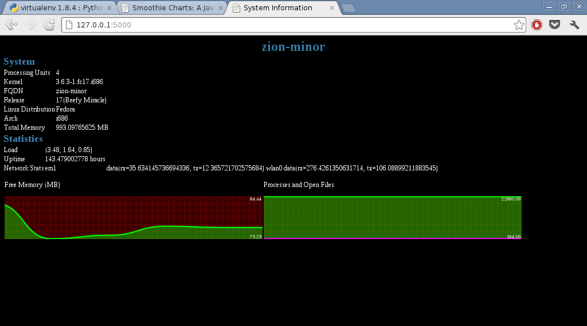

Quick Start
===========

`pylinux` consists of two modules: `pylinux.py` and `readproc.py`. The
`pylinux` module uses the `readproc` module for some of its
functionalities. 

Installation
------------

virtualenv install ::

    $ virtualenv pylinux
    $ cd pylinux
    $ git clone https://github.com/amitsaha/pylinux
    $ cd pylinux
    $ python setup.py install

System-wide install ::

    $ git clone https://github.com/amitsaha/pylinux
    $ cd pylinux
    $ sudo python setup.py install

Usage
-----

To use the `pylinux` module, import it as ::

    import pylinux.pylinux as pylinux

Similarly, to use the `readproc` module, use it as ::

    import pylinux.readproc as readproc

The example script `examples/example.py` demos most of the features of
the `pylinux` module. When you run it, you can see various information
about your system ::

    $ ./example.py 
    Distribution::  Fedora 17 Beefy Miracle
    OS Architecture:: i686
    Kernel::  3.6.3-1.fc17.i686
    Total Memory:: 1016932 kB
    Processor: 0 Physical ID: 0
    Processor: 1 Physical ID: 0
    Processor: 2 Physical ID: 0
    Processor: 3 Physical ID: 0
    Hostname::  zion-minor
    IP Address to connect to external server::  192.168.101.238
    System Uptime:: 143.226058333 hours
    Time of Last Boot:: ['2012-12-14', '20:44']
    Current Users:: gene gene gene gene gene gene gene
    Free Memory:: 95516 kB
    Number of Processes:: 190
    Number of Open Files:: 22439
    Average Load:: (0.13, 0.31, 0.41)
    Network Devices:: 
    em1: Recieved (MB): 35.6341457367 Transmitted (MB): 12.3657217026
    wlan0: Recieved (MB): 274.533976555 Transmitted (MB): 105.382452011

Web application
---------------
The `flask_app` directory in `examples`, contains a rudimentary Flask_ web application
which uses `pylinux` to expose various information about your system. It
also uses jQuery_ and smoothie_ charts to update dynamic statistics, such as
the free memory and network device statistics. 

.. _Flask: http://flask.pocoo.org
.. _jQuery: http://jquery.com
.. _smoothie: http://smoothiecharts.org/

Install Flask using ::
    $ pip-python install flask

To start the web application, go to the `examples/flask_app` directory
and run the `app.py` file, like so ::

    $ python app.py
    * Running on http://0.0.0.0:5000/
    * Restarting with reloader

Now, visit the URL `http://<your ip>:5000` and you should see a page
similar to :

